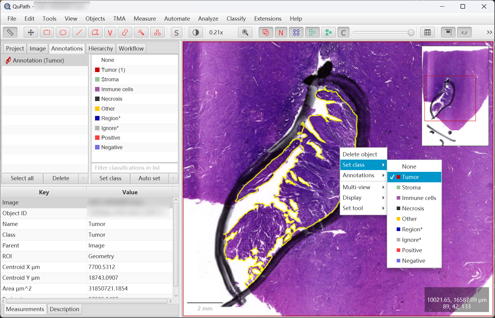
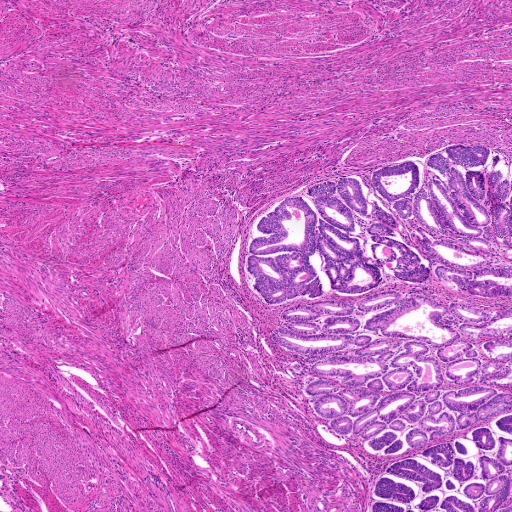
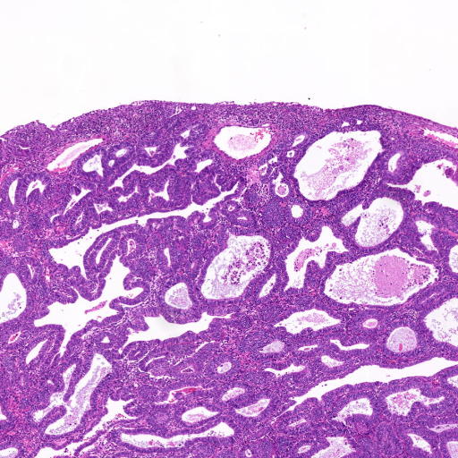
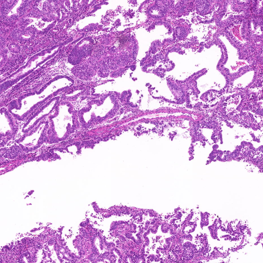
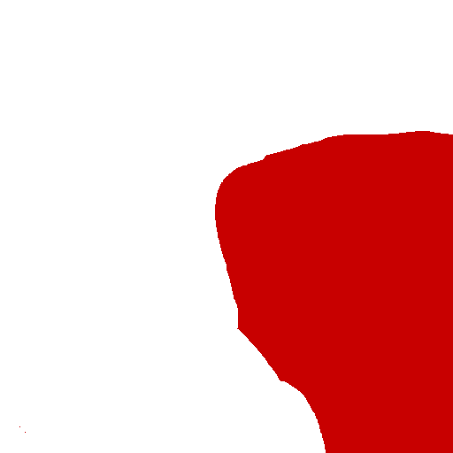
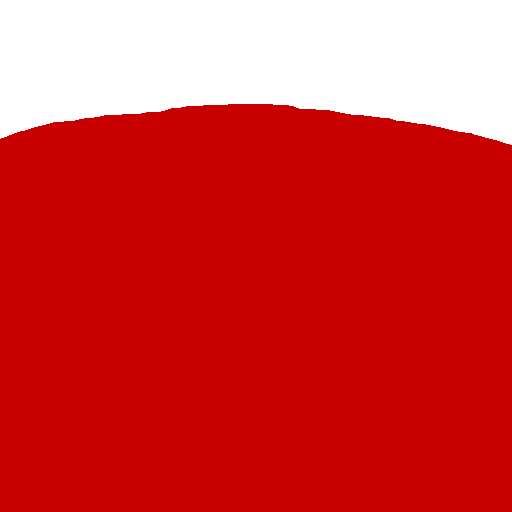
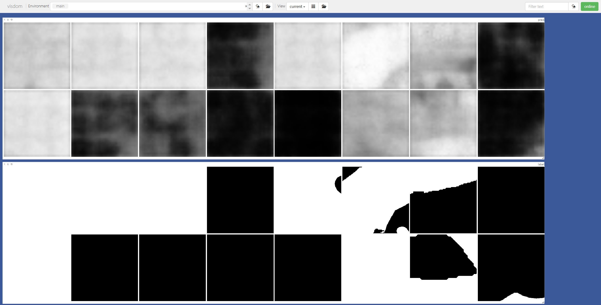

# WSI Segmenter

> A tool for tile-level tumor-area segmentation or ROI segmentation. Works with QuPath (Version >= 0.4.2).
> The model utilizes the [DeepLabV3](https://arxiv.org/abs/1706.05587) architecture with a pretrained ResNet backbone.

### Updates 

1. **[03/2025]** Currently the repository only supports training your own tumor segmentation model. We will open-source the weights trained on the public dataset (to avoid possible privacy violations) in two months, stay tuned!

2. **[05/2025]** We have open-sourced the training code and weights based on the public dataset [tsr-crc](https://zenodo.org/records/4024676). Details can be found in `inference.py` and `eg\train_tsr-crc.py`. Please extract patches at **20x** or higher **(recommend 256x256)** for better performance.

### Usage

1. run `pip install -r requirements.txt` for installing dependencies.

2. run `make_tile_mask_pairs.groovy` in QuPath to generate tile-mask pairs. Details in [image.sc](https://forum.image.sc/t/exporting-annotations-as-rgb-image-tiles-or-cut-out-annotations-not-binary/77691)

Please ensure you have made the annotation in the QuPath and specified your parameters in the script.



3. after running the step, you now have the following folder structure:
```
├── /PATH/TO/DATA
│   ├── slide_1
│   │   ├── patch_1.jpeg  # tile
│   │   ├── patch_1.png  # mask
│   │   ├── ...
│   ├── slide_2
│   │   ├── patch_1.jpeg  # tile
│   │   ├── patch_1.png  # mask
│   │   ├── ...
│   ├── ...
│   └── slide_n
│       ├── ...
│       └── patch_n.png
```

The example structure can be found in the `eg` folder. 

Suffix:
- `jpeg` for tile
- `png` for mask


|                  pair a                  |                  pair b                  |                  pair c                  |
|:----------------------------------------:|:----------------------------------------:|:----------------------------------------:|
|  a.jpeg |  b.jpeg |  c.jpeg |
|   a.png  |   b.png  |   c.png  |

4. run the following command to train and visualize the training process:
```bash
python -m visdom.server
```

```bash
python train.py --data_dir /PATH/TO/DATA --epochs 20
```

The prediction (up) and ground truth (down) will be shown and refreshed in the visdom server.



5. or use the pre-trained model to predict the mask of your own data. The model is trained on the [tsr-crc](https://zenodo.org/records/4024676) dataset. 

    [[Google Drive](https://drive.google.com/file/d/1K_DaQlLcM26ZsIg3UNSfizpDBmo_MrBB/view?usp=sharing)]  Download the weights and place it in the `checkpoints` folder.

6. you can also apply this with your patch extraction code.

```python
import torch
import cv2
from torchvision import transforms
from torchvision.models.segmentation import deeplabv3_resnet50

def tile_contains_tumor(img, seg_model, device, threshold_tumor=0.5):
    # tile is Image object
    img = cv2.resize(img, (256, 256))  # we strongly recommend to extract patches at 20x or higher
    img = cv2.cvtColor(img, cv2.COLOR_BGR2RGB)
    # to tensor
    tile = transforms.ToTensor()(img).unsqueeze(0).to(device)
    with torch.no_grad():
        seg_model.eval()
        output = torch.sigmoid(seg_model(tile)['out']).mean()

    if output < threshold_tumor:
        return True
    else:
        return False
    
def TileExporter():
    # your code here
    pass

if __name__ == "__main__":
    # load the model
    device = torch.device("cuda" if torch.cuda.is_available() else "cpu")
    model = deeplabv3_resnet50(num_classes=1)
    model.load_state_dict(torch.load('checkpoints/tsr_crc.pt'))
    model = model.to(device)
    # extract patches 
    tiles = TileExporter()
    for tile in tiles:
        if tile_contains_tumor(tile, model, device):
            # do something
        else:
            # do something
    # save the result
```

