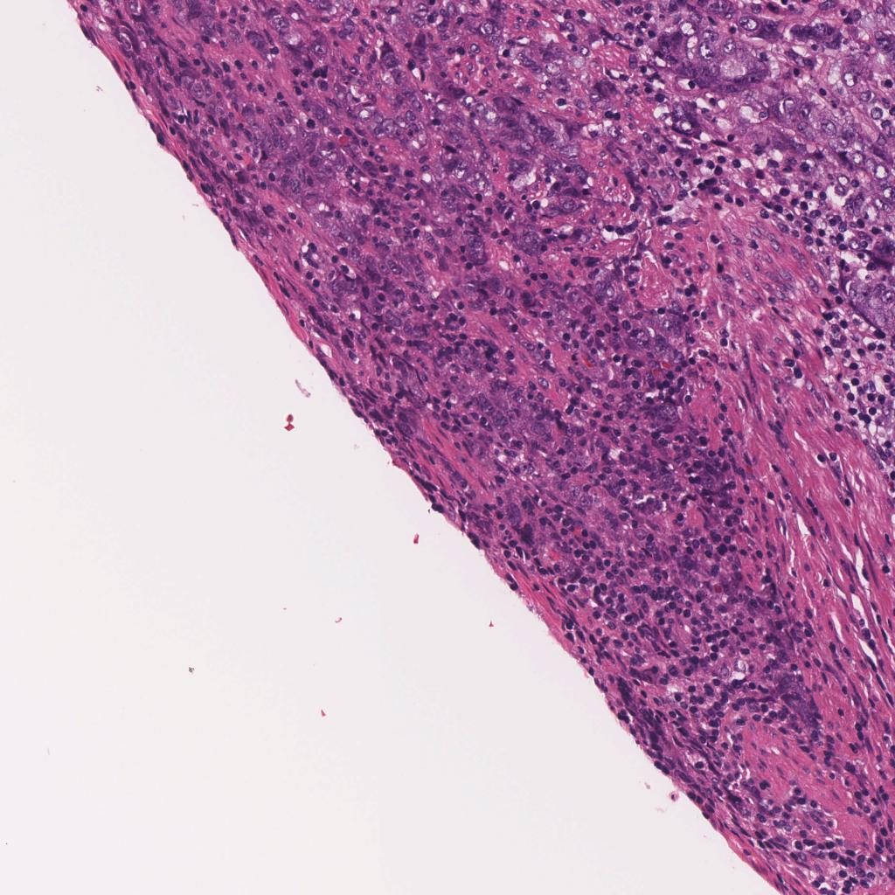
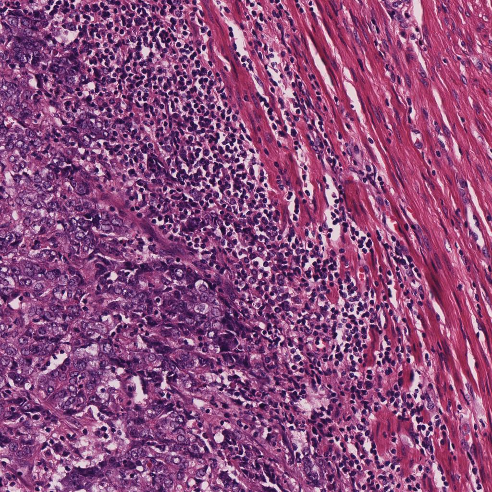
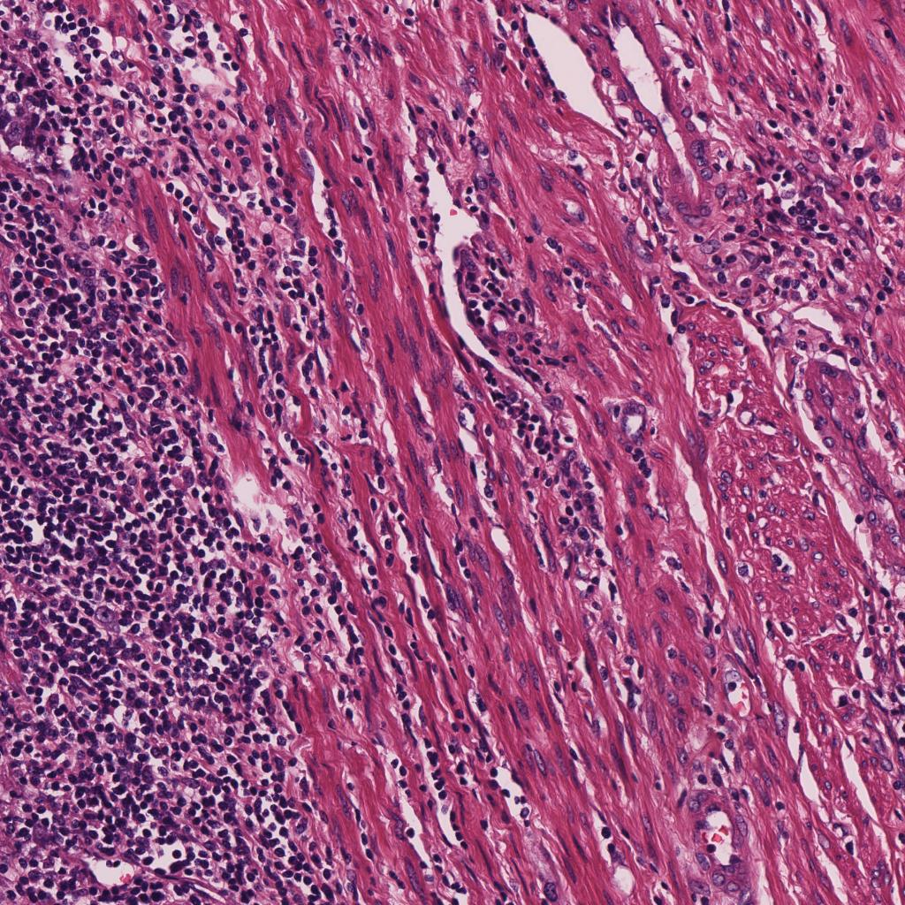

# WSI Patcher

> A simple tool for tile-level tumor-area segmentation or ROI segmentation. Works with QuPath (Version >= 0.4.2).
> The model utilizes the [DeepLabV3](https://arxiv.org/abs/1706.05587) architecture with a pretrained ResNet backbone.

## Usage

1. run `pip install -r requirements.txt` for installing dependencies.

2. run `make_tile_mask_pairs.groovy` in QuPath to generate tile-mask pairs. See also [image.sc](https://forum.image.sc/t/exporting-annotations-as-rgb-image-tiles-or-cut-out-annotations-not-binary/77691)

Please make sure you have made the annotation in the QuPath and specified your own parameters in the script.


3. after running the step, you now have the following folder structure:
```
├── /PATH/TO/DATA
│   ├── slide_1
│   │   ├── patch_1.jpeg  # tile
│   │   ├── patch_1.png  # mask
│   │   ├── ...
│   ├── slide_2
│   │   ├── patch_1.jpeg  # tile
│   │   ├── patch_1.png  # mask
│   │   ├── ...
│   ├── ...
│   └── slide_n
│       ├── ...
│       └── patch_n.png
```

The example structure can be found in the `eg` folder. 

Suffix:
- `jpeg` for tile
- `png` for mask

|            tile-mask pair a             |            tile-mask pair b             |            tile-mask pair c             |
|:---------------------------------------:|:---------------------------------------:|:---------------------------------------:|
|  |  |  |
|   |   |   |

4. run the following command to train and visualize the training process:
```bash
python -m visdom.server
```

```bash
python train.py --data_dir /PATH/TO/DATA --epochs 20 -v
```

The prediction (up) and ground truth (down) will be shown and refreshed in the visdom server.


5. you can also apply this with your patch extraction code.

```python
import torch
from torchvision import transforms

def tile_contains_tumor(tile, seg_model, device, threshold_tumor=0.5):
    # tile is Image object
    tile = tile.convert("RGB")
    tile = tile.resize((256, 256))
    # to tensor
    tile = transforms.ToTensor()(tile).unsqueeze(0).to(device)
    with torch.no_grad():
        seg_model.eval()
        output = torch.sigmoid(seg_model(tile)['out']).mean()

    if output < threshold_tumor:
        return True
    else:
        return False
    
def TileExporter():
    # your code here
    pass

if __name__ == "__main__":
    # load the model
    device = torch.device("cuda" if torch.cuda.is_available() else "cpu")
    # load the saved model
    model = torch.load(r'best.pt').to(device)
    # extract patches 
    tiles = TileExporter()
    for tile in tiles:
        if tile_contains_tumor(tile, model, device):
            # do something
        else:
            # do something
    # save the result
```

